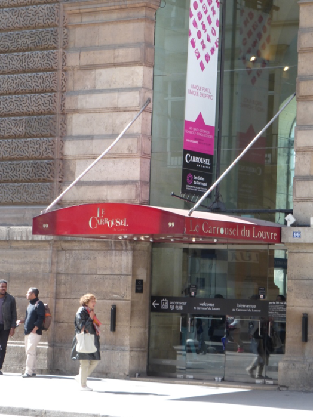

**En novembre 1996**, à quelques centaines de mètres de la Salle Richelieu, le troisième théâtre de la Comédie-Française ouvre ses portes.Son nom, le Studio-Théâtre, est une référence au premier Studio du Théâtre d’Art de Moscou voulu par Stanislavski en 1912. En appelant de ses voeux un lieu dont les proportions permettraient l’élaboration de spectacles favorisant « quelque chose de particulièrement intime, allant droit au coeur des spectateurs », Stanislavski généra un besoin. Afin de réaliser pour la Comédie-Française un projet de cette nature, **Jean-Pierre Miquel**, alors administrateur, s’adressa à l’architecte **Michel Sené**.

La galerie du Carrousel, qui conduit de la rue de Rivoli au musée du Louvre, venait d’être creusée. La réussite espérée ne pouvait être que le fruit d’un délicat et savant compromis entre les utopies d’un nouvel espace théâtral et les énormes contraintes liées à la topographie des lieux. Parvenir à dégager, sans jamais avoir l’impression d’exiguïté, tant d’éléments : une scène de 50 m2, quatre loges, une cabine pour la régie technique et un volume suffisamment grand pour y installer sur des gradins 136 spectateurs avec, pour tous, une visibilité parfaite, est un véritable tour de force.

**En octobre 2003**, la Société des Comédiens-Français a souhaité que l’espace de représentation soit nommé **Salle Jean-Pierre Miquel** (né le [22](fr.wikipedia.org/wiki/22_janvier) [janvier](fr.wikipedia.org/wiki/Janvier_1937) [1937](fr.wikipedia.org/wiki/1937_au_th%C3%A9%C3%A2tre) et mort le [22](fr.wikipedia.org/wiki/22_f%C3%A9vrier) [février](fr.wikipedia.org/wiki/F%C3%A9vrier_2003) [2003](fr.wikipedia.org/wiki/2003_au_th%C3%A9%C3%A2tre)).