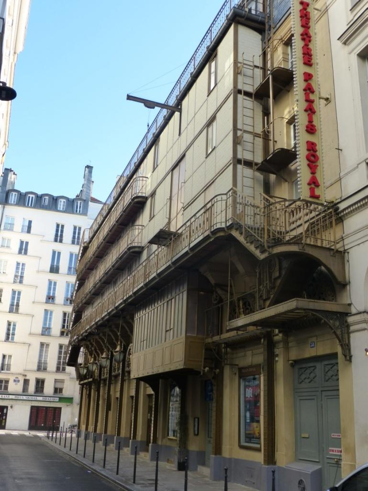
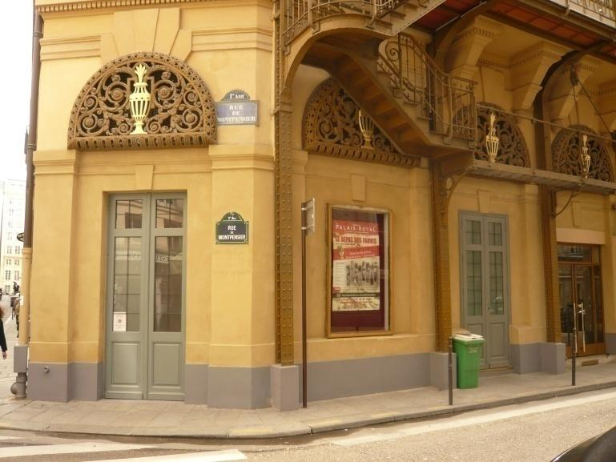

Afin de casser le monopole de l'[Hôtel de Bourgogne](https://fr.wikipedia.org/wiki/H%C3%B4tel_de_Bourgogne_(Paris)), le [Cardinal de Richelieu](https://fr.wikipedia.org/wiki/Armand_Jean_du_Plessis_de_Richelieu) fait élever en 1637 un théâtre sur l'aile est du bâtiment du Palais-Royal (à l'emplacement de l'actuelle [Comédie-Française](https://fr.wikipedia.org/wiki/Com%C3%A9die-Fran%C3%A7aise)). L'inauguration a lieu en 1641. Le [Théâtre-Italien](https://fr.wikipedia.org/wiki/Th%C3%A9%C3%A2tre-Italien) et la troupe de [Molière](https://fr.wikipedia.org/wiki/Moli%C3%A8re) se partagent la scène entre 1662 et 1673.

À la mort de son ancien collaborateur, [Lully](https://fr.wikipedia.org/wiki/Jean-Baptiste_Lully) récupère les lieux pour y fonder l'[Académie royale de musique](https://fr.wikipedia.org/wiki/Acad%C3%A9mie_royale_de_musique). Il renvoie la [troupe de Molière](https://fr.wikipedia.org/wiki/Troupe_de_Moli%C3%A8re) qui s'installe dans l'[Hôtel de Guénégaud](https://fr.wikipedia.org/wiki/Salle_du_Jeu_de_paume_de_la_Bouteille) et charge [Carlo Vigarani](https://fr.wikipedia.org/wiki/Carlo_Vigarani) de remplacer la [machinerie](https://fr.wikipedia.org/wiki/Machinerie_(th%C3%A9%C3%A2tre)) installée en 1645 par [Giacomo Torelli](https://fr.wikipedia.org/wiki/Giacomo_Torelli) par une nouvelle capable de supporter les imposants décors de ses futurs [Opéras](https://fr.wikipedia.org/wiki/Op%C3%A9ra_(musique)). Son gendre, [Jean-Nicolas de Francine](https://fr.wikipedia.org/wiki/Jean-Nicolas_de_Francine), lui succède à sa mort en 1687.

Cette première salle est détruite par un incendie le 6 avril 1763. Rouverte le 26 janvier 1770, elle brûle à nouveau le 8 juin 1781, lors d'une représentation d'[Orphée](https://fr.wikipedia.org/wiki/Orph%C3%A9e_et_Eurydice) de [Gluck](https://fr.wikipedia.org/wiki/Christoph_Willibald_Gluck). L'Académie royale de musique se transporte alors [boulevard Saint-Martin](https://fr.wikipedia.org/wiki/Boulevard_Saint-Martin) dans une salle construite spécialement pour elle en deux mois par [Nicolas Lenoir](https://fr.wikipedia.org/wiki/Nicolas_Lenoir) (le futur [théâtre de la Porte-Saint-Martin](https://fr.wikipedia.org/wiki/Th%C3%A9%C3%A2tre_de_la_Porte-Saint-Martin)).

[Philippe d'Orléans](https://fr.wikipedia.org/wiki/Louis-Philippe_d%27Orl%C3%A9ans_(1747-1793)) (futur Philippe-Égalité), qui venait d'hériter de [son père](https://fr.wikipedia.org/wiki/Louis-Philippe_d%27Orl%C3%A9ans_(1725-1785)) le [Palais-Royal](https://fr.wikipedia.org/wiki/Palais-Royal), profite de l'occasion pour réaménager les jardins en faisant édifier par [Victor Louis](https://fr.wikipedia.org/wiki/Victor_Louis) un ensemble d'immeubles uniformes, comportant des galeries marchandes au rez-de-chaussée surmontées d’appartements d’habitation, entouré de trois nouvelles rues baptisées des titres de ses trois fils ([Valois](https://fr.wikipedia.org/wiki/Louis-Philippe_Ier), [Beaujolais](https://fr.wikipedia.org/wiki/Louis-Charles_d%27Orl%C3%A9ans) et [Montpensier](https://fr.wikipedia.org/wiki/Antoine_d%27Orl%C3%A9ans_(1775-1807))). L'ancienne salle est reconstruite et confiée en 1785 à la troupe de [Variétés-Amusantes](https://fr.wikipedia.org/wiki/Th%C3%A9%C3%A2tre_des_Vari%C3%A9t%C3%A9s-Amusantes) chassée du boulevard Saint-Martin par l'Académie royale de musique voisine.

À l’opposé de la [rue de Montpensier](https://fr.wikipedia.org/wiki/Rue_de_Montpensier), dans le péristyle de Joinville, Victor Louis édifie une autre petite salle destinée à présenter les spectacles de marionnettes d'un certain Lomel. Elle est inaugurée le 23 octobre 1784.

Le Sieur Delomel, le premier directeur, est un tourneur sur bois et ses comédiens sont de grandes marionnettes à fil qu’il sculpte lui-même et fait habiller par un tailleur du voisinage.Sa troupe fait de l’ombre à l’Opéra. La sanction ne tarde guère à tomber et en 1788, c’est la fin des « Petits comédiens de S.A.S. Monseigneur le Comte de Beaujolais ».

En juin 1789 Madame de Montansier alors Directrice de tous les spectacles à la suite de la Cour, rachète le Théâtre. La période est troublée, mais les parisiens, entre deux barricades, courent au spectacle.La Montansier a déjà 60 ans, mais directrice avertie, elle sait trouver les auteurs et les interprètes qui enchantent ce public en mal de plaisir et de légèreté. Elle propose des opéras-comiques et des comédies.

En mai 1812, sous l’Empire, le Théâtre vit une période difficile et ferme définitivement.

Le 6 juin 1831, Le Théâtre du Palais Royal rouvre avec à sa tête M. Dormeuil.

Il faut attendre 1838 et la découverte d’un jeune auteur de 23 ans, Eugène Labiche, pour que le Théâtre du Palais Royal renoue avec le succès.De 1838 à 1877, Eugène Labiche, aidé de ses collaborateurs, offrira à son répertoire 88 comédies.

En 1860, Dormeuil abandonne la direction à son fils Francis de Plunkett.Après la guerre de 70, les temps sont plus difficiles, Offenbach meurt, Labiche n’écrit plus, Dormeuil et de Plunkett démissionnent, c’est la fin d’une époque.
La nouvelle direction effectue des travaux de restauration et de décoration. Le maître d’œuvre en est l’architecte Paul Sédille.
Mussay, autre directeur dénicheur de talents qui accueille un élégant jeune inconnu dont il accepte le manuscrit Monsieur Chasse.
C’est le début de sa complicité avec Georges Feydeau. Six pièces de Georges Feydeau seront créées : Après Monsieur Chasse, Le Système Ribatier, Un Fil à la patte, Le Dindon, Séance de Nuit, et la dernière pièce de Feydeau, Hortense a dit : Je m’en fous !

L'extérieur du bâtiment (façades et toiture) fait l'objet d'un classement au titre des [monuments historiques](https://fr.wikipedia.org/wiki/Monument_historique_(France)) depuis le 16 mars 1930, l'ensemble du théâtre d'une inscription depuis le 3 août 1993.

Avec la deuxième guerre mondiale et son cortège de privations, débute l’ère de Jean de Létraz, auteur comique, qui dirige le théâtre pendant douze ans.

En 1965, sa femme, Simone de Létraz abandonne la direction à Jean-Michel Rouzière qui, à 34 ans, a déjà derrière lui vingt ans de carrière à différents postes du théâtre.

Le 5 fevrier 1973, c’est la première de La Cage aux Folles de Jean Poiret, mise en scène par Pierre Mondy, avec Michel Serrault.

C’est en 1989 que Jean-Michel Rouzière disparaît.En décembre 1989, Francis Lemonnier reprend la direction avec ses deux associés Francis Nani et Christian Azzopardi.

  

En 1998 mort de Francis Lemonnier et reprise de la direction du théâtre par Francis Nani et Christian Azzopardi.