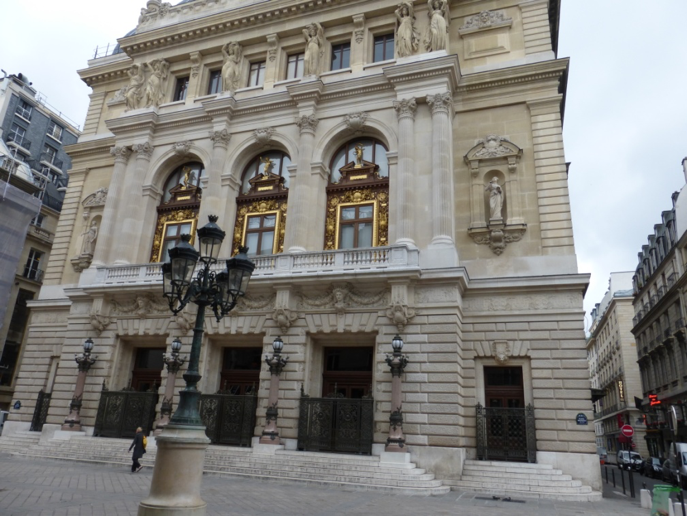

L'**Opéra Comique** est créé sous le règne de Louis XIV, **le [26 décembre](https://fr.wikipedia.org/wiki/26_d%C3%A9cembre "26 décembre") [1714](https://fr.wikipedia.org/wiki/1714_au_th%C3%A9%C3%A2tre "1714 au théâtre")** par [**Catherine Baron**](https://fr.wikipedia.org/w/index.php?title=Catherine_Baron&action=edit&redlink=1 "Catherine Baron (page inexistante)") et [**Gautier de Saint-Edme**](https://fr.wikipedia.org/w/index.php?title=Gautier_de_Saint-Edme&action=edit&redlink=1 "Gautier de Saint-Edme (page inexistante)") à partir de troupes qualifiées de « foraines » qui se produisaient lors des spectacles donnés lors des [foires annuelles de Paris](https://fr.wikipedia.org/wiki/Th%C3%A9%C3%A2tre_de_la_foire "Théâtre de la foire").

L'une des troupes de la [foire Saint-Germain](https://fr.wikipedia.org/wiki/Th%C3%A9%C3%A2tre_de_la_foire "Théâtre de la foire") prit alors le nom d'**Opéra-Comique**.. Il s'agit de l'une des plus anciennes institutions théâtrales et musicales de France avec l'Opéra de Paris (anciennement Académie royale de musique) et la Comédie-Française.\
**A partir de 1783**, l'Opéra Comique présente ses saisons dans un théâtre qui a pris le nom d'un fameux auteur de livrets, Charles-Simon Favart.

La Salle Favart brûle une première fois dans la nuit du **14 au [15](https://fr.wikipedia.org/wiki/15_janvier "15 janvier") [janvier](https://fr.wikipedia.org/wiki/Janvier_1838 "Janvier 1838") [1838](https://fr.wikipedia.org/wiki/1838_en_musique_classique "1838 en musique classique")**, elle sera reconstruite **en 1840** sous la direction de [**Théodore Charpentier**](https://fr.wikipedia.org/wiki/Th%C3%A9odore_Charpentier "Théodore Charpentier").

**Le [25](https://fr.wikipedia.org/wiki/25_mai "25 mai") [mai](https://fr.wikipedia.org/wiki/Mai_1887 "Mai 1887") [1887](https://fr.wikipedia.org/wiki/1887_en_musique_classique "1887 en musique classique") à 21 heures**, un incendie détruit de nouveau la salle pendant la représentation du premier acte de *Mignon*. Elle sera reconstruite  par l'architecte [**Louis Bernier**](https://fr.wikipedia.org/wiki/Louis_Bernier "Louis Bernier") et sera inaugurée le **7 décembre 1898** sur un modèle moins strict que les précédents, avec une riche statuaire.

Les difficultés financières du théâtre dans les [**années 1930**](https://fr.wikipedia.org/wiki/Ann%C3%A9es_1930 "Années 1930"), entraînent l'intervention de l'État qui, le **13 août [1936](https://fr.wikipedia.org/wiki/1936_en_musique_classique "1936 en musique classique")**, rapproche par décret l'Opéra-Comique du [théâtre national de l'Opéra](https://fr.wikipedia.org/wiki/Op%C3%A9ra_de_Paris "Opéra de Paris"), pour former la [Réunion des théâtres lyriques nationaux](https://fr.wikipedia.org/wiki/R%C3%A9union_des_th%C3%A9%C3%A2tres_lyriques_nationaux "Réunion des théâtres lyriques nationaux") (RTLN) sous l'administration de [Jacques Rouché](https://fr.wikipedia.org/wiki/Jacques_Rouch%C3%A9 "Jacques Rouché"). Le **[14](https://fr.wikipedia.org/wiki/14_janvier "14 janvier") [janvier](https://fr.wikipedia.org/wiki/Janvier_1939 "Janvier 1939") [1939](https://fr.wikipedia.org/wiki/1939_en_musique_classique "1939 en musique classique")**, la nouvelle structure devient un [établissement public](https://fr.wikipedia.org/wiki/%C3%89tablissement_public_(France) "Établissement public (France)") à part entière, placée sous l'égide du [ministère de l'Éducation nationale](https://fr.wikipedia.org/wiki/Minist%C3%A8re_de_l%27%C3%89ducation_nationale_(France) "Ministère de l'Éducation nationale (France)").

Après une première fermeture **en [1971](https://fr.wikipedia.org/wiki/1971_en_musique_classique "1971 en musique classique")**, l'**Opéra-Comique** cesse son activité le **[30](https://fr.wikipedia.org/wiki/30_novembre "30 novembre") [novembre](https://fr.wikipedia.org/wiki/Novembre_1972 "Novembre 1972") [1972](https://fr.wikipedia.org/wiki/1972 "1972")** pour devenir **de 1974 à 1978** un lieu de formation pour les jeunes chanteurs sous le nom d'« Opéra-Studio ». La Réunion des théâtres lyriques nationaux est dissoute officiellement le **[7](https://fr.wikipedia.org/wiki/7_f%C3%A9vrier "7 février") [février](https://fr.wikipedia.org/wiki/F%C3%A9vrier_1978 "Février 1978") [1978](https://fr.wikipedia.org/wiki/1978_en_musique_classique "1978 en musique classique")** au profit d'une nouvelle structure unique : le [Théâtre national de l'Opéra](https://fr.wikipedia.org/wiki/Th%C3%A9%C3%A2tre_national_de_l%27Op%C3%A9ra "Théâtre national de l'Opéra"). La salle Favart devient alors la seconde salle de spectacle de l'Opéra. C'est dans ce contexte qu'a lieu la création d'[*Atys*](https://fr.wikipedia.org/wiki/Atys_(op%C3%A9ra) "Atys (opéra)") de [Lully](https://fr.wikipedia.org/wiki/Jean-Baptiste_Lully "Jean-Baptiste Lully") par [William Christie](https://fr.wikipedia.org/wiki/William_Christie_(musicien) "William Christie (musicien)") et [Jean-Marie Villégier](https://fr.wikipedia.org/wiki/Jean-Marie_Vill%C3%A9gier "Jean-Marie Villégier") en 1987.

Elle recouvre son indépendance **en [1990](https://fr.wikipedia.org/wiki/1990_en_musique_classique "1990 en musique classique")** sous forme d'une [association loi de 1901](https://fr.wikipedia.org/wiki/Association_loi_de_1901 "Association loi de 1901"), à la suite de l'inauguration d'une nouvelle salle pour l'[Opéra de Paris](https://fr.wikipedia.org/wiki/Op%C3%A9ra_de_Paris "Opéra de Paris") : l'[Opéra Bastille](https://fr.wikipedia.org/wiki/Op%C3%A9ra_Bastille "Opéra Bastille"). Elle est successivement dirigée par **Thierry Fouquet** (1989-1994), **Pierre Médecin** (1994-2000) et [**Jérôme Savary**](https://fr.wikipedia.org/wiki/J%C3%A9r%C3%B4me_Savary "Jérôme Savary") (2000-2005).

Le théâtre est régi, depuis le **[1er](https://fr.wikipedia.org/wiki/1er_janvier "1er janvier") [janvier](https://fr.wikipedia.org/wiki/Janvier_2005 "Janvier 2005") [2005](https://fr.wikipedia.org/wiki/2005_en_musique_classique "2005 en musique classique")**, par le décret no 2004-1232 fixant le statut du [théâtre national](https://fr.wikipedia.org/wiki/Th%C3%A9%C3%A2tre_national_(France) "Théâtre national (France)") de l'**Opéra-Comique** qui devient ainsi un établissement public à caractère industriel et commercial ([EPIC](https://fr.wikipedia.org/wiki/%C3%89tablissement_public_%C3%A0_caract%C3%A8re_industriel_et_commercial "Établissement public à caractère industriel et commercial")). L'article 2 de ce décret lui confie une mission très large puisqu'il peut représenter des ouvrages lyriques, mais aussi des [pièces de théâtre](https://fr.wikipedia.org/wiki/Pi%C3%A8ce_de_th%C3%A9%C3%A2tre "Pièce de théâtre") sans musique. Son répertoire s'étend de la [musique baroque](https://fr.wikipedia.org/wiki/Musique_baroque "Musique baroque") à la [musique contemporaine](https://fr.wikipedia.org/wiki/Musique_contemporaine "Musique contemporaine").

L'**Opéra-Comique** est dirigé par [Jérôme **Deschamps**](https://fr.wikipedia.org/wiki/J%C3%A9r%C3%B4me_Deschamps "Jérôme Deschamps") depuis le **[27](https://fr.wikipedia.org/wiki/27_juin "27 juin") [juin](https://fr.wikipedia.org/wiki/Juin_2007 "Juin 2007") [2007](https://fr.wikipedia.org/wiki/2007 "2007")**. **Le 29 avril**, la nomination d'**Olivier Mantei**, directeur adjoint de **l'Opéra-Comique** et codirecteur des [Bouffes-du-Nord](https://fr.wikipedia.org/wiki/Th%C3%A9%C3%A2tre_des_Bouffes-du-Nord "Théâtre des Bouffes-du-Nord"), est annoncée à compter **de juin 2015** en remplacement de **Jérôme Deschamps** atteint par la limite d'âge.
