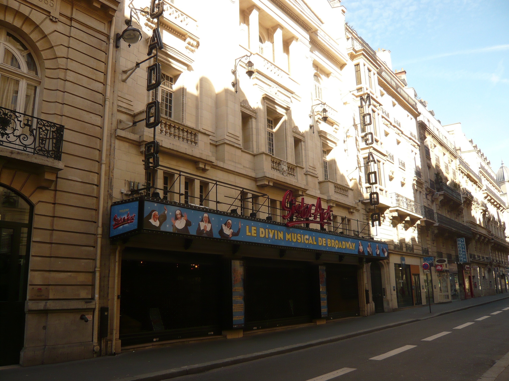

**1919 : Sir Alfred Butt**, le plus grand impresario anglais du début du 20ème siècle, décide d’offrir un théâtre à l’amour de sa vie, la danseuse **Régine Flory**, découverte **en 1910** dans de nombreuses revues données au Concert Mayol. **Alfred Butt** engage la jeune **Régine Flory** et la lance en grande vedette de son **Palace londonien** où elle triomphe pendant la guerre **de 1914-1918**. Il lui construit ensuite un théâtre à Paris, copié sur le modèle du Palladium de Londres.

**Le Palace-Théâtre**, futur **Mogador**, se construit au 25 rue de Mogador, sur d’anciennes écuries. L’architecte anglais Bertie Crewe y reproduit l’incomparable structure anglaise des salles de spectacles : la salle, tout en comptant 1 800 places, toutes de face, offre aux spectateurs un confort exceptionnel et une visibilité parfaite. Avec une scène de 10.70 mètres d’ouverture, sur 12.70 mètres de profondeur, le théâtre parvient à être intime et les spectateurs proches de la scène.

**21 avril 1919** : le théâtre ouvre ses portes avec la revue « Hello Paris ! » menée par **Régine Flory**. La mise en scène est luxueuse, les rythmes de la musique rag-time trépidants. C’est après l’inauguration du **« Palace Théâtre »** que la salle devient le **Théâtre Mogador**.

**Entre 1920 et 1922**, 14 opérettes oubliées sont reprises à Mogador qui devient le premier théâtre d’opérette de Paris. Parmi celles-ci, on retiendra notamment : « Madame l’Archiduc » (Jacques Offenbach), « La Petite Mariée » (Charles Lecocq) ou encore « La Petite Bohème » (Henri Hirshmann).

**En 1925** : les frères **Emile et Vincent Isola** reprennent le théâtre pour le ramener à son destin musical. Anciens directeurs des Folies Bergère, de la Gaîté Lyrique, de l’Olympia, du Sarah Bernhardt et de l’Opéra Comique, ils consacrent **Mogador** à l’opérette pendant dix ans, et en font un grand théâtre populaire. 

Se succédèrent ensuite des spectacles de variétés avec **en 1937, Mistinguette** en meneuse de revue sur « Ca, c’est parisien ». De grands noms se sont également produits sur la scène de Mogador : Tino Rossi, Jacques Meyran. Mais surtout Marcel Merkès et Paulette Merval qui formèrent le couple impérial de l’opérette et restèrent l’un des plus forts symboles du lieu (8000 représentations).

La première comédie musicale arrive à **Mogador en 1969** avec « Monsieur Pompadour » de Claude Bowling et Françoise Dorin. Suivent d’autres comédies musicales : « Hello Dolly » **en 1972** avec **Annie Cordy**, « Douchka » **en 1973** avec **Charles Aznavour**, ou encore « La Révolution Française » **en 1974**.

Suite à une période difficile marquée par diverses fermetures, **Mogador** fait peau neuve. Après soixante deux années d’exploitation, la salle est restaurée et comporte alors 1792 places assises et offre un point de vue dégagé de toutes parts : il n’y a plus aucun pilier. La programmation va être très diversifiée : « Le Grand Avocat », d’Henri Denker, mise en scène par Robert Hossein, qui assure la réouverture du théâtre.

**Le 8 janvier 1983** avec Roger Hanin en tête d’affiche. Le 1er octobre, « Cyrano de Bergerac » d’Edmond Rostand est interprété par Jacques Weber et Charlotte de Turckheim. Le succès est au rendez-vous avec 500.000 spectateurs.

« Cabaret » de Jérôme Savary révèle Ute Lemper ; s’ensuit la production « Les Misérables » de Mackintosh.
**Mogador** accueille également des concerts : Higelin, Sting, Indochine… sans oublier Barbara qui se bat pour que **Mogador** soit classé monument historique dans les années quatre-vingts. De nombreuses comédies musicales vont être presentées au théâtre Mogador « Starmania », « Cabaret », « My Fair Lady », « A Chorus Line », « Hair », « Carmen », « Notre Dame de Paris », « Emilie Jolie », « Elvis Story », « Bagdad Café », ou encore « Swan Lake » (le « Lac des Cygnes » de Matthew Bourne) qui remporte un énorme succès.

Le **Théâtre Mogador** a été racheté **en 2005** par le groupe **Stage Entertainment France** qui propose aujourd’hui les productions de grand musical de Broadway, en langue française, avec des artistes et des musiciens français.
